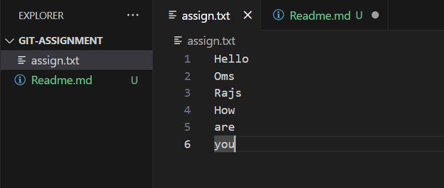

## Git Assignment 1 - Basic Git Workflow

## 1. Repository with Commit History
    This repository contains a '.git' folder that preserves the full commit history from the initial commit through the final commit. The history includes four commits:
    a. Initial commit
    b. First commit with change in first line from Hii to Hello
    c. Second commit with change in second line from Om to Oms
    d. Final commit with change in third line from Raj to Rajs
    

## 2. Screenshot of Git Log Output
    Below is the screenshot
    
    

## 3. Brief explanation of the changes made in each commit
    **Initial Commit**
    Created the repository
    Added an initial file(assign.txt)

    **First Commit**
    Modified the existing first line by removing previous line
    Example : My first line was Hii and I modified into Hello

    **Second Commit**
    Modified the existing second line by removing previous line
    Example : My second line was Om and I modified into Oms

    **Final Commit**
    Final Update to the file
    Example : My third line was Raj and I modified into Rajs

## Git Assignment 2 - GitHub Basics & Collaboration
    Commited